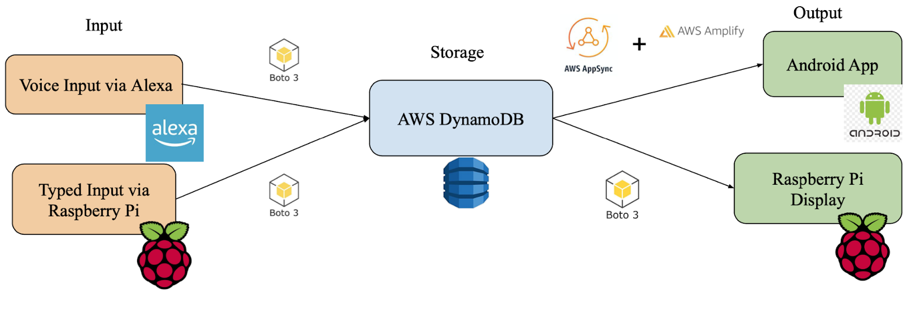
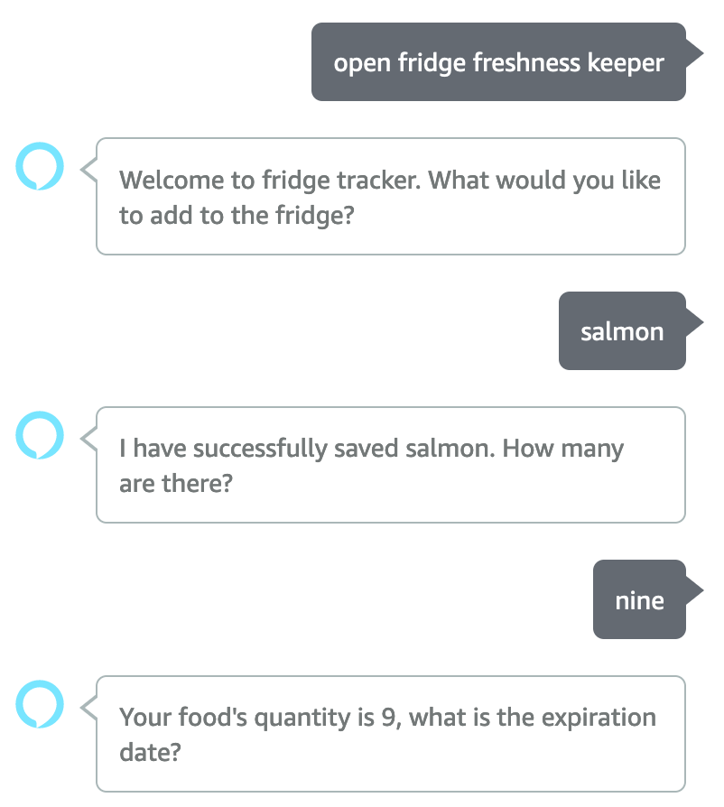

## Fridge-Freshness-Keeper

**A Georgia Tech CDAIT IoT Challenge Project**

**Design Team**
- Zechuan Ding, School of ECE, zding72@gatech.edu
- Yue Pan, School of ECE, ypan331@gatech.edu
- Yihua, Xu, School of Math and School of History and Sociology, yxu604@gatech.edu

**Links**
- [Demo Video](https://youtu.be/w1Gjtki0x8E)
- [Project Report](https://docs.google.com/document/d/1jFisFSvs9kEznSA4-92oM_S1GHq3HtN5IAoPb1JMBIw/edit?usp=sharing)
- [Github Repository](https://github.com/CPA872/Fridge-Freshness-Keeper)  (Refer here for reproducing our project)

## TLDR

Fridge-Freshness-Keeper is a fridge managing and food tracking system. It consists of a Raspberry Pi mounted on the fridge, a mobile app installed on an Android device, and an Alexa Skill. Users will be able to look up and manage their fridge conten through the three aspects. 

## Motivation

As we have a tremendous amount of food being wasted on a daily basis, it is integral for us to stay vigilant and attentive to food’s shelf life in case they are discarded for food spoilage. To tackle the problem of food wastage and let people optimize their food utilization, we propose the Fridge-Freshness-Keeper: a smart IoT system that can track the shelf-life of foods stored in the fridge and alert users about expiring items. 

In particular, Fridge-Freshness-Keeper attempts to solve the following two difficulties with traditional fridge management:
- It is hard to keep track of shelf lives of foods, because with regards to a particular item in the fridge, people may fail to recall it’s purchase date, or are reluctant to locate and check the expiration date on its package. Our IoT design enables users to save food’s shelf life in the IoT system and conveniently look them up through multiple sources.
- It is easy to forget what is put into the fridge. Furthermore, items in the fridge are often stacked, making identifying all items at a glance challenging. Our system helps users to remember such trivial things. By either voice-inputting or typing on the screen after each purchase, users can easily keep track of foods inside their refrigerator. 

## Overview of Solution

<!--  -->

As shown above, three phases are implemented to solve the problem of fridge food waste. On the input side, there are two ways for adding purchased items into the system. The Alexa Skill + voice recognition allows users simultaneously put items into the fridge and log items to our system. The typed input via Raspberry Pi touchscreen allows users to log food items using the on-screen keyboard. After input items are logged, they are combined using Boto3 into a shared DynamoDB database. 

On the input side, there are two ways for adding purchased items into the system. The Alexa Skill + voice recognition allows users simultaneously put items into the fridge and log items to our system. The typed input via Raspberry Pi touchscreen allows users to log food items using the on-screen keyboard. After input items are logged, they are combined using Boto3 into a shared DynamoDB database. 

On the output side, the Raspberry Pi mounted on the refrigerator shows a list of food inside the fridge, as well as their quantities and shelf lives. Moreover, it monitors the humidity and temperature inside the fridge. The Android App connected to DynamoDB using AWS AppSync and AWS Amplify displays the food information pulled from the cloud. The Android App can also push notifications to users alerting approaching food expiration dates. 

## Methodology and Implementation
This section explains the technical implementation of the three aspect of the system: Raspberry Pi, Alexa, and Android app.

### Raspberry Pi GUI
The GUI interface on the Raspberry Pi is designed with QT, a popular tool for developing cross-platform GUI applications in C++. The development of a QT application consists of two stages: first, the code is written and the program is tested on a more powerful PC, and second, the program is cross compiled to the Raspberry Pi’s ARM architecture. Lastly, the executable binary is copied to Raspberry Pi via scp in the local network. 

The GUI design is straightforward. The food list is displayed using a QTableWidget with three columns: name, count or quantity, and shelf life. The four buttons below the table perform actions to the selected row (item) in the table. Users can add or minus one to the quantity, delete it from the table, or sync the current table with the cloud database. Sorting is achieved by clicking the column title of the table for desired order. On the right of the window, the button labeled “NEW ITEM” provides the entry to add a new item to the table. Below is the information for users’ convenience: current date and time, as well as the temperature and humidity inside the fridge provided by the sensor.

After clicking the NEW ITEM button, the “Add a new item” window is shown in the above figure. Users can enter the name of the food using the on-screen keyboard, and update the count and shelf life fields using the plus/minus buttons. After pressing the CONFIRM button, the new food is added to the table and the cloud database is updated. 

### Alexa Skill

Powered by Alexa Skills, the voice-controlled user input is enabled by a set of three conversations. Firstly, the user invokes the Alexa Skill by saying “open fridge freshness keeper” and is prompted by Alexa's greeting: “Welcome to fridge tracker. What would you like to add to the fridge?” The user then replies with a food name. Then, Alexa obtains the food name and prompts the following: “I have successfully saved [food]. How many are there?” With the user voicing a specific number, Alexa then logs the specific quantity for [food] and asks the following question: “Your food's quantity is [number], what is the expiration date?” The user can reply flexibly in one of the following forms: “[number] days”; specific dates in the form - “[year][month][day]”; “this/next [day of the week]”; “tomorrow”, etc. Finally, Alexa automatically calculates the shelf life based on the information provided and asks whether the user would like to add anything else to the fridge. 

### Android App

The main UI in the Android App is shown in the above figure. We chose to design the UI as straightforward and simple as possible. The development environment is set up using Google’s Android Studio and Amplify, a third-party AWS SDK for Android Apps. 
The main component of the Android UI is a ListView widget. This provides a list-like display format that is suitable for displaying foods in the user’s fridge. For enhanced user experience, instead of using the default ListView, we designed a CustomListAdapter for displaying information in a hierarchical manner. In the custom ListView, each element in the list contains three fields: A bold text in the first row for displaying the name of the food, as well as two smaller text fields in the second row indicating the quantities of food remaining and the shelf life. 
The figure in the middle shows the dropdown menu that is accessed from the right of the title bar. The manu contains four options for sorting and syncing with the cloud database. Upon a sorting request, different custom Java Comparators are used to enforce the requested order. For example, the figure on the far right shows the contents after sorting by shelf life. Upon a refresh request, an Amplify API query is called to handle the communication with the table on AWS DynamoDB. The response from the query is then parsed and used to reset the current ListView.

### Cross-platform Communication

The communications across the three platforms, Raspberry Pi, Alexa, and Android App, is achieved using two DynamoDB tables. The first table, named “fridge-freshness-keeper”, is managed by Alexa to store the newly added items after the previous sync. Upon new input from the user, Alexa adds the item into the fridge-freshness-keeper table. The second table, named “ffk-sync”, is managed by the Raspberry Pi and accessed by the Android App. When the Pi performs a sync operation, which is done every 30 seconds or per user’s request, it first pulls items from the fridge-freshness-keeper table to collect the new items added by Alexa and clears that table. Then, the Pi combines items from Alexa with the items added using the Pi. Finally, the contents of the ffk-sync table is overwritten with the combined items from Alexa and Pi, and now the ffk-sync table contains the most up-to-date foods. After this, when the Android App performs the refresh operation by querying the ffk-sync table, the App should receive the up-to-date food information.
	DynamoDB is a part of AWS services, and performing CRUD (create, read, update, delete) operations on the tables requires different interfacing methods for different platforms. Alexa Skills provide convenient integration with DynamoDBs residing in personal AWS accounts through the boto3 library. On the Pi, interfacing with the table is achieved through a Python script that is routinely called by the main QT program. The Python script utilizes the same boto3 library, but requires special authentications using the AWS CLI (Amazon Web Services Command Line Interface). On the Android App, communication with the table is achieved through Amplify, an AWS SDK, and AWS App Sync, an AWS service providing GraphQL wrappers for data sources like DynamoDB.

## Next Steps
- The GUI interfaces can be designed better. We lack necessary skills on UI design principles and methods. Therefore, the designed Raspberry Pi GUI and Android App only meet the functional goal. A better looking UI will greatly enhance the user experience. 
- The Refrigeration Gas Sensor (model ZMOD4450) can be integrated into our IoT. During the prototyping process, we find it very challenging to work with the sensor because there are very few references online since the sensor is a proprietary product. With the addition of the sensor, once gas released by spoiled food is detected from the fridge, alerts can be sent to users asking for attention.
- A mobile app targeting the iOS platform is a good choice for expanding the user body.
- Methods to integrate the IoT hardware with existing fridges, such as mounting the screen and Pi onto the fridge door, should be developed when the product enters mass production. The power cables for the Pi and screen should also be integrated to reduce the overhead for setting up the system. 
